<!-- ╔══════════════════════════════════════════════════════════════╗ -->
<!-- ║  yogender-ai — A Profile Unlike Any Other                  ║ -->
<!-- ╚══════════════════════════════════════════════════════════════╝ -->

<div align="center">
  
</div>

<br>

<!-- ━━━━━━━━━━━━━━━━━━━━ INTRO ━━━━━━━━━━━━━━━━━━━━ -->

<div align="center">
  <a href="https://github.com/yogender-ai">
    
  </a>
</div>

<br>

<div align="center">
  
  &nbsp;&nbsp;
  
  &nbsp;&nbsp;
  
</div>

<br>


<br>

<!-- ━━━━━━━━━━━━━━━━━━━━ ABOUT ━━━━━━━━━━━━━━━━━━━━ -->

<table align="center" border="0" cellpadding="0" cellspacing="0">
<tr>
<td width="50%" valign="top">

### `> whoami`

```
┌──────────────────────────────────┐
│                                  │
│   Yogender                       │
│   AI Engineer & Creator          │
│   Based in India 🇮🇳              │
│                                  │
│   Building at the intersection   │
│   of artificial intelligence     │
│   and beautiful design.          │
│                                  │
│   I don't just write code —      │
│   I architect experiences.       │
│                                  │
└──────────────────────────────────┘
```

</td>
<td width="50%" valign="top">

### `> cat interests.yml`

```yaml
currently_building:
  → AI-Powered Directory Management
  → Neural Network Stock Predictions
  → Interactive Physics Simulations

exploring:
  → Generative AI & LLMs
  → WebAssembly & Rust
  → Real-time Data Visualization

philosophy: |
  "Make it work. Make it right.
   Make it beautiful."
```

</td>
</tr>
</table>

<br>


<br>

<!-- ━━━━━━━━━━━━━━━━━━━━ TECH STACK ━━━━━━━━━━━━━━━━━━━━ -->

<div align="center">

### `⚙ tech.stack`

<br>

| Domain | Technologies |
|:------:|:-------------|
| **Languages** |       |
| **AI / ML** |     |
| **Frontend** |     |
| **Backend** |     |
| **Data** |    |
| **DevOps** |      |

</div>

<br>


<br>

<!-- ━━━━━━━━━━━━━━━━━━━━ STATS ━━━━━━━━━━━━━━━━━━━━ -->

<div align="center">

### `📊 metrics`

<br>

<a href="https://github.com/yogender-ai">
  
</a>
&nbsp;&nbsp;&nbsp;
<a href="https://github.com/yogender-ai">
  
</a>

<br><br>

<a href="https://github.com/yogender-ai">
  
</a>

<br><br>

<a href="https://github.com/yogender-ai">
  
</a>

</div>

<br>


<br>

<!-- ━━━━━━━━━━━━━━━━━━━━ PROJECTS ━━━━━━━━━━━━━━━━━━━━ -->

<div align="center">

### `🔬 featured.work`

<br>

<a href="https://github.com/yogender-ai/AI-Powered-Directory-Management-System">
  
</a>
&nbsp;&nbsp;
<a href="https://github.com/yogender-ai/Hybrid-Fuzzy-Neural-Network-for-Stock-Market-Prediction">
  
</a>

<br><br>

<a href="https://github.com/yogender-ai/Particle-Gravity-Fun">
  
</a>
&nbsp;&nbsp;
<a href="https://github.com/yogender-ai/lion-cat-dog-demo">
  
</a>

</div>

<br>


<br>

<!-- ━━━━━━━━━━━━━━━━━━━━ TROPHIES ━━━━━━━━━━━━━━━━━━━━ -->

<div align="center">

### `🏆 achievements`

<br>

<a href="https://github.com/yogender-ai">
  
</a>

</div>

<br>


<br>

<!-- ━━━━━━━━━━━━━━━━━━━━ SNAKE ━━━━━━━━━━━━━━━━━━━━ -->

<div align="center">

### `🐍 contributions`

<br>

<picture>
  <source media="(prefers-color-scheme: dark)" srcset="https://github.com/yogender-ai/yogender-ai/blob/output/github-contribution-grid-snake-dark.svg" />
  <source media="(prefers-color-scheme: light)" srcset="https://github.com/yogender-ai/yogender-ai/blob/output/github-contribution-grid-snake.svg" />
  
</picture>

</div>

<br>


<br>

<!-- ━━━━━━━━━━━━━━━━━━━━ CONNECT ━━━━━━━━━━━━━━━━━━━━ -->

<div align="center">

### `📡 connect`

<br>

<a href="https://github.com/yogender-ai">
  
</a>
&nbsp;
<a href="mailto:your.email@example.com">
  
</a>
&nbsp;
<a href="https://linkedin.com/in/yogender">
  
</a>
&nbsp;
<a href="https://twitter.com/yogender">
  
</a>

<br><br>

<sub>
  if you find my work interesting, consider ⭐ starring some repos — it means a lot.
</sub>

</div>

<br><br>

<!-- ━━━━━━━━━━━━━━━━━━━━ FOOTER ━━━━━━━━━━━━━━━━━━━━ -->

<div align="center">
  
</div>

<!-- ═══════════════════════════════════════════════════ -->
<!--  yogender-ai · github.com/yogender-ai             -->
<!-- ═══════════════════════════════════════════════════ -->
