<!-- Animated assets are generated by .github/scripts/build_assets.py — edit the data there and re-run. -->
<!-- Live stats + snake are rebuilt every 12h by .github/workflows/snake.yml and served from the `output` branch. -->

 

 

 

  
  
  
  
  
  

<b>➕ more things I've built</b>

 

| Project | What it does | Stack |
|:--|:--|:--|
| [FinanceInsight](https://github.com/yogender-ai/FinanceInsight) | Reads annual reports & 10-Ks end-to-end: sections, events, tables, metrics | Python · NLP · Docker |
| [DayForge](https://dayforge.yogender1.me) | Focused habit tracker with honest streaks and a contribution-graph month view | JS · Python |
| [CodeShelf](https://github.com/yogender-ai/CodeShelf) | Coding memory: revision cards, spaced repetition, reminder emails | React · FastAPI · Postgres |
| [Linux Ops Lab](https://github.com/yogender-ai/Linux-Ops-Monitoring-Lab) | Prometheus + Grafana + Alertmanager → Jira incident lab | Docker · Bash |
| [KNN Cat vs Dog](https://github.com/yogender-ai/knn-cat-dog-demo) | K-nearest-neighbours image classifier from scratch | Python · CV |
| [Recursion X-Ray](https://github.com/yogender-ai/Recursion-Xray) | Visualises recursive calls and stack frames step by step | JS |
| [Aether](https://aether-surface.vercel.app) | A living start surface — frontend challenge | HTML · CSS |
| [Hybrid Fuzzy NN](https://github.com/yogender-ai/Hybrid-Fuzzy-Neural-Network-for-Stock-Market-Prediction) | Fuzzy logic + neural network for stock-market prediction | Python · ML |

 

 

 

<picture>
  <source media="(prefers-color-scheme: dark)" srcset="https://raw.githubusercontent.com/yogender-ai/yogender-ai/output/github-contribution-grid-snake-dark.svg" />
  <source media="(prefers-color-scheme: light)" srcset="https://raw.githubusercontent.com/yogender-ai/yogender-ai/output/github-contribution-grid-snake.svg" />
  
</picture>

 

