<!-- Animated assets are generated by .github/scripts/build_assets.py — edit the data there and re-run. -->
<!-- Live stats + snake are rebuilt every 12h by .github/workflows/snake.yml and served from the `output` branch. -->

<a href="https://yogender1.me"></a>

 

<!-- Social & Portfolio Badges -->

 

  

> 🚀 **AI / ML Engineer & High-Performance Systems Builder**  
> ⚔️ **Level 17 Algorithm Grandmaster** · **283+ LeetCode Solved** · 🔥 **74-Day Continuous Streak** · Top 26% Contest Rank  
> ⚡ *Shipping production AI, real-time distributed backends & interactive 3D experiences — not just Jupyter notebooks.*

 


 

  <a href="https://github.com/yogender-ai/DSA-LeetCode-Journey"></a>
  <a href="https://github.com/yogender-ai/NewsIntel"></a>
  <a href="https://cloud-command.vercel.app"></a>
  <a href="https://fun-particle.yogender1.me/"></a>
  <a href="https://github.com/yogender-ai/knn-cat-dog-demo"></a>
  <a href="https://github.com/yogender-ai/FinanceInsight"></a>

<b>➕ more things I've built</b>

 

| Project | What it does | Stack |
|:--|:--|:--|
| [PassDesk](https://passdesk.vercel.app) | 6-digit remote desktop screen sharing for Linux, Mac, Windows | Electron · WebRTC · React |
| [NexusCRM](https://crm-iota-sepia-80.vercel.app) | AI-native mini CRM: audience segmentation, smart campaigns & performance metrics | React · FastAPI · Gemini |
| [PingBot](https://github.com/yogender-ai/Site-MOnitoring) | Self-hosted uptime monitor with real-time charts & anti-sleep engine | React · Express · PostgreSQL |
| [DayForge](https://dayforge.yogender1.me) | Focused habit tracker with honest streaks and a contribution-graph month view | JS · Python |
| [CodeShelf](https://github.com/yogender-ai/CodeShelf) | Coding memory: revision cards, spaced repetition, reminder emails | React · FastAPI · Postgres |
| [Linux Ops Lab](https://github.com/yogender-ai/Linux-Ops-Monitoring-Lab) | Prometheus + Grafana + Alertmanager → Jira incident lab | Docker · Bash |
| [Recursion X-Ray](https://github.com/yogender-ai/Recursion-Xray) | Visualises recursive calls and stack frames step by step | JS |
| [Aether](https://aether-surface.vercel.app) | A living start surface — frontend challenge | HTML · CSS |
| [Hybrid Fuzzy NN](https://github.com/yogender-ai/Hybrid-Fuzzy-Neural-Network-for-Stock-Market-Prediction) | Fuzzy logic + neural network for stock-market prediction | Python · ML |

 


 

<a href="https://github.com/yogender-ai/DSA-LeetCode-Journey"></a>

 

<!-- Rendered by github.com/yogender-ai/algorithm-replay and rebuilt daily in the journey repo. -->

Not a loop of pictures: the algorithm is really executed and every comparison it makes becomes a frame. <a href="https://github.com/yogender-ai/algorithm-replay">Put it in your own README →</a>

 
 

<!-- The wall is redrawn by .github/workflows/sign-the-wall.yml whenever someone signs. -->
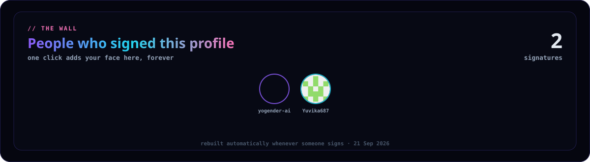

One click. A bot adds your avatar to the image above and closes the issue. 
No form, no account linking, nothing to install — you are just <i>on</i> someone's profile.

 
 

<!-- Painted by .github/workflows/profile-bot.yml, one pixel per issue. -->
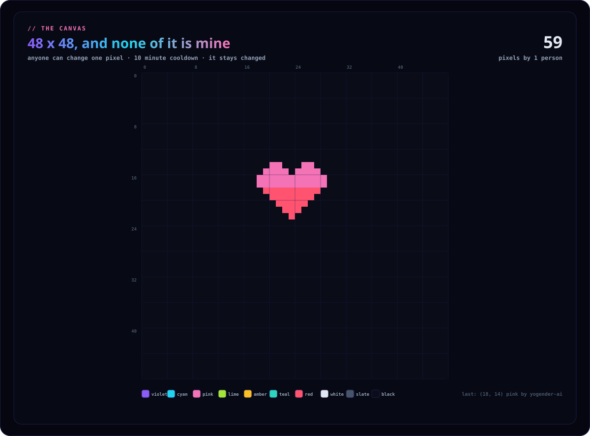

Edit the coordinates in the issue title, hit submit, and that pixel is yours. 
One pixel every 10 minutes per person. Nothing here gets reverted — whatever it becomes, it stays.

 

<!-- Redrawn every 6h by sync_leetcode.py from the public contributions calendar. -->
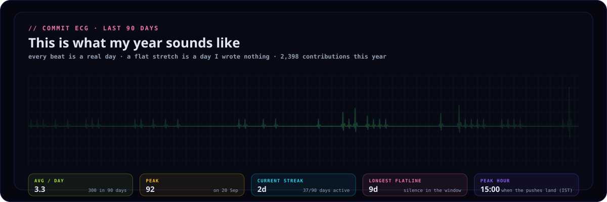

Every beat is a real day and the height is that day's contribution count, so the
quiet weeks are a genuine flatline. Read left to right, it is the last 90 days of my life
as a cardiac monitor.

<picture>
  <source media="(prefers-color-scheme: dark)" srcset="https://raw.githubusercontent.com/yogender-ai/yogender-ai/output/github-contribution-grid-snake-dark.svg" />
  <source media="(prefers-color-scheme: light)" srcset="https://raw.githubusercontent.com/yogender-ai/yogender-ai/output/github-contribution-grid-snake.svg" />
  
</picture>

 

